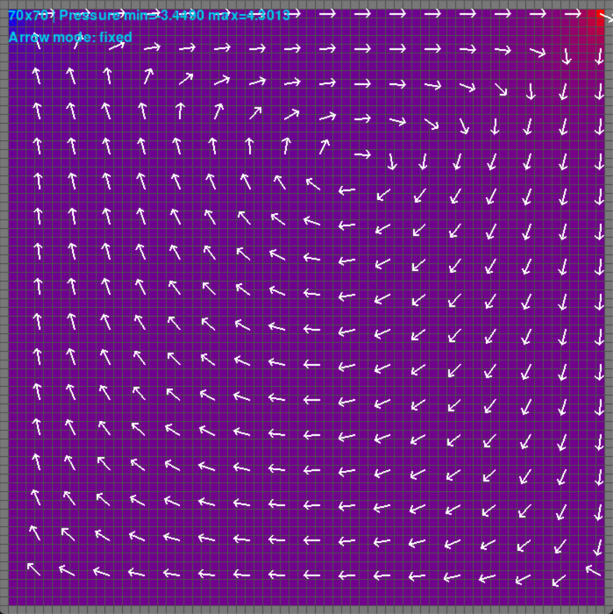
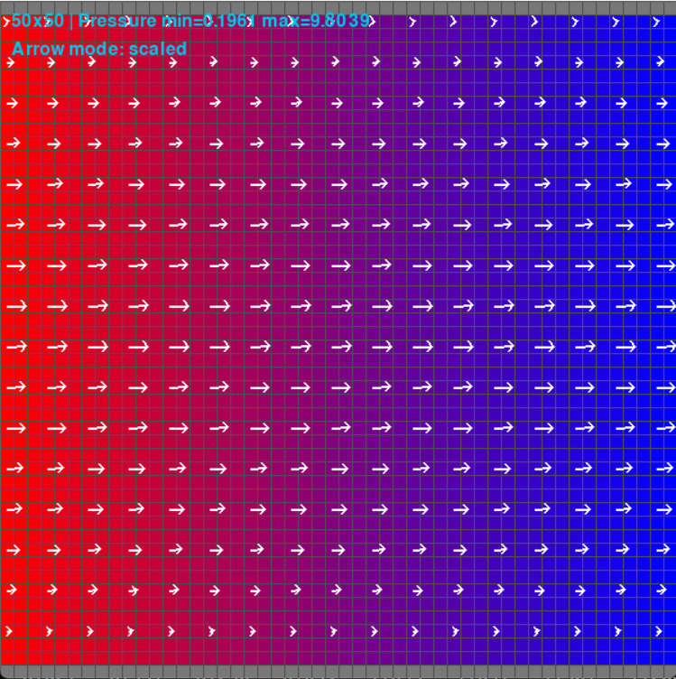
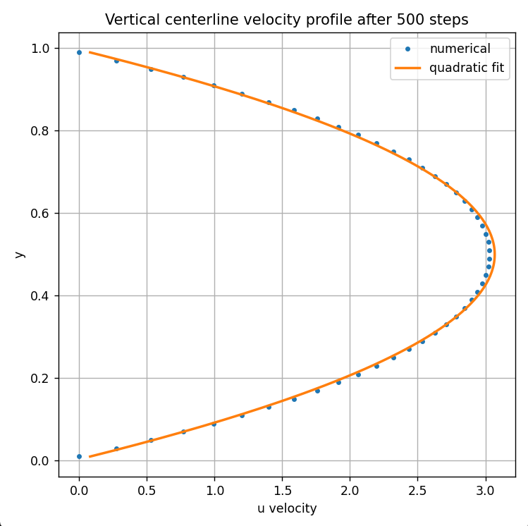

# FlowGrid

A C++ computational fluid dynamics solver for incompressible flow on a staggered grid, built to explore numerical PDE methods, performance-oriented system design, and benchmark-driven validation. The long-term objective is to extend the solver toward airfoil flow simulation.



## Capabilities

FlowGrid currently includes the following core features:

- A 2D incompressible flow solver based on a staggered-grid formulation
- Support for custom boundary conditions to define different flow setups
- C++ solver implementation with Python bindings for experimentation and analysis
- A Python visualizer for inspecting simulation results
- Pre-built setups for the lid-driven cavity and pressure-driven channel test cases
- Sparse Poisson pressure solve using preconditioned conjugate gradient with an IC(0) preconditioner

## Benchmarking and Validation

### Lid-Driven Cavity

FlowGrid is validated against the classic lid-driven cavity setup: fluid is placed inside solid walls and the top wall, called the lid, moves sideways.

The benchmark data is obtained from **Ghia et al. (1982)**. For **Re = 100**, the solver output is compared against the reference centerline velocity profiles on a **100 × 100** grid.

The primary comparison is made using the cavity centerline velocity profiles:

- **\(u\)** along the **vertical centerline**
- **\(v\)** along the **horizontal centerline**

For this benchmark case, the solver achieves:

- **RMSE = 0.0324** for the horizontal velocity component \(u\)
- **RMSE = 0.0216** for the vertical velocity component \(v\)
- **Execution time = 14.53 s** on a **100 × 100** grid using a Release build

These results show good agreement with the Ghia reference data and provide an initial validation of the solver’s accuracy for incompressible cavity flow. 

---

### Pressure-Driven Channel

FlowGrid is also validated on a **pressure-driven channel flow** benchmark.

In this setup, pressure is fixed on the **left** and **right** boundaries, creating a constant pressure drop across the channel, while the **top** and **bottom** boundaries are treated as solid no-slip walls. This produces the classical plane Poiseuille flow configuration.



As expected, the solver develops a smooth channel flow profile with velocity approaching zero near the walls and reaching a maximum at the channel centerline. The boundary layer imposed by the no-slip condition is clearly visible, and the pressure field shows a nearly constant gradient from left to right.

To validate the result, the simulated streamwise velocity profile across the channel height is compared against a fitted parabola corresponding to the analytical Poiseuille solution.



The match is near perfect, confirming that the solver correctly reproduces the expected parabolic velocity distribution for pressure-driven laminar flow. Together with the linear pressure drop across the domain, this provides strong evidence that both the pressure boundary conditions and wall treatment are implemented correctly.

## Build and Usage

### Prerequisites

To build FlowGrid, you will need:

- **CMake**
- A **C++17-compatible compiler**
- **Python 3**
- **Ninja** (optional, but used in the commands below)
- **pybind11**, included in this repository as a submodule

Make sure submodules are initialized before building:

```bash
git submodule update --init --recursive
```

### Build
A typical build using Ninja would look like:

```bash
cmake -S . -B build -G Ninja
cmake --build build
```

For performance benchmarks and simulations, use a Release build:

```bash
cmake -S . -B build -G Ninja -DCMAKE_BUILD_TYPE=Release
cmake --build build
```

### Python Interpreter Notes

FlowGrid includes Python bindings through **pybind11**, so CMake must detect the correct Python installation.

On some systems, CMake may automatically pick a different Python version than the one you normally use. For example, if your default interpreter is Python 3.10, CMake might still configure the bindings against another installed version such as Python 3.13.

If that happens, specify the interpreter explicitly during configuration:

```bash
cmake -S . -B build -G Ninja -DPython3_EXECUTABLE=/path/to/python
cmake --build build
```

On Windows, this may mean passing the full path to the Python executable you want CMake to use.

### Running Examples

After building the project, the main entry points are the Python setup scripts and the benchmark executable.

#### Python Setups

The two pre-built flow setups can be run with:

```bash
python python/setups/lid_driven_cavity.py
python python/setups/pressure_driven_channel.py
```
In both setup scripts, a constant variable can be toggled to choose between profile mode and visualizer mode:

- visualizer mode displays the simulated flow field
- profile mode generates the velocity-profile output used for benchmark comparison

These scripts use the Python bindings together with the visualizer to run and inspect the corresponding flow case.

#### Benchmark

The lid-driven cavity benchmark executable is generated in the `build/` directory.

Run it with (on PowerShell):

```bash
./build/lid_driven_cavity_benchmark
```

This benchmark is used to compare the solver output against the reference cavity-flow data.

## Project Structure

The repository is organized into a few main components:

- `src/core/` contains the core CFD solver implementation, including the main simulation data structures and logic such as the **pressure field**, **velocity field**, **boundary conditions**, **grid**, and **simulator**.
- `src/linalg/` contains the linear algebra utilities used by the solver, including the **Poisson operator**, **conjugate gradient method**, and **Incomplete Cholesky IC(0) preconditioner** used in the pressure projection step.
- `src/python/` contains the **Python bindings** that expose the C++ solver to Python.
- `include/` contains the header files defining the classes and methods implemented in `src/`.
- `python/` contains the Python-side utilities, including the **visualizer** and the predefined setup scripts under `python/setups/`.
- `benchmarks/` contains the benchmark code used to validate solver behavior against reference results.
- `tests/` contains automated tests, split into **unit tests** and **integration tests**.
- `images/` contains the figures used in the README and other project documentation.
- `external/pybind11/` contains the **pybind11** submodule used for Python bindings.

## Numerical Method

FlowGrid is based on the **incompressible Navier-Stokes equations** and follows the general staggered-grid framework presented in **Bridson's fluid simulation notes**.

The computational domain is discretized on a **2D staggered grid**:

- **pressure** values are stored at the **cell centers**
- the horizontal velocity component **\(u\)** is stored on the **vertical cell faces**
- the vertical velocity component **\(v\)** is stored on the **horizontal cell faces**

This arrangement improves pressure-velocity coupling because each velocity component is stored exactly where the corresponding face flux is evaluated, while pressure remains at cell centers. That makes the discrete pressure gradient and divergence operators interact more naturally.

In practice, this helps suppress non-physical high-frequency oscillations such as **checkerboard modes** that can appear on collocated grids, and typically leads to lower discretization error in incompressible-flow simulations.

The solver currently includes the main components needed for this formulation:

- **advection** to transport the velocity field through the domain
- **body forces** to incorporate external forcing terms
- a **projection step** to enforce incompressibility by making the velocity field divergence-free
- a **viscosity step** to simulate fluids with varying amount of viscosity 
- **boundary condition handling** to impose solid-wall no-slip constraints


Together, these components form the core numerical pipeline used in the lid-driven cavity and pressure-driven channel simulations.

## Implementation Details

A few implementation choices are especially important for the solver's robustness and performance.

### Advection Boundary Handling

To improve the stability and accuracy of the advection step, sampled positions that fall outside the grid are clamped to the nearest valid cell index. This prevents invalid memory access and avoids introducing artificial values when tracing characteristics near the domain boundary.

### Boundary Condition Representation

Boundary conditions are handled through a dedicated `BoundaryConditions` class. It supports:

- prescribed **\(v\)** values on horizontal-velocity faces
- prescribed **\(u\)** values on vertical-velocity faces
- prescribed **\(p\)** values on pressure cells, including boundary locations

This makes it possible to express different flow setups in a flexible way while keeping boundary logic separate from the main solver update steps.

### Projection Step and Linear Solve

The most computationally expensive part of the simulation is the **projection step**, where a linear system must be solved to enforce incompressibility.

A naive dense solve using Gaussian elimination would scale as **\(O(n^3)\)** in the number of unknowns. Since a 2D grid with side length **\(m\)** has roughly **\(n = m^2\)** pressure unknowns, this becomes **\(O(m^6)\)**, which is too expensive for larger grids.

In this problem, however, the pressure equation produces a **symmetric positive semidefinite Poisson system**. By fixing the pressure at one cell, the system becomes **symmetric positive definite**, which makes it suitable for the **conjugate gradient method**.

This is a major improvement because:

- the method works directly with the structure of the Poisson problem
- it benefits from the fact that the matrix is **sparse**
- each iteration is much cheaper than a dense elimination step

In practice, for this type of grid-based Poisson solve, conjugate gradient often gives behavior closer to **\(O(m^3)\)**, while a pessimistic bound is around **\(O(m^4)\)**. This makes it far more suitable than Gaussian elimination for pressure projection in incompressible flow simulation.

FlowGrid now uses a preconditioned conjugate gradient method for the pressure solve. The pressure matrix is represented by a dedicated `PoissonOperator`, which stores the sparse grid-based system and builds an Incomplete Cholesky IC(0) preconditioner.

The preconditioner approximates the Poisson matrix as

\[
A \approx LL^T
\]

while preserving the local grid stencil structure. During each CG iteration, the residual is approximately solved through forward and backward triangular sweeps. This reduces the effective condition number of the system and significantly improves convergence compared with unpreconditioned CG.


## Future Work

Planned next steps for FlowGrid include:

- adding support for **flow over an airfoil**, extending the solver beyond the current cavity and channel benchmarks
- improving the **user interface** for configuring and interacting with simulations
- making the **conjugate gradient solver multithreaded** to accelerate the projection step

## License

This project is released under the MIT License.


## References

- Robert Bridson, *Fluid Simulation for Computer Graphics*
- U. Ghia, K. N. Ghia, and C. T. Shin, *High-Re solutions for incompressible flow using the Navier-Stokes equations and a multigrid method*, 1982